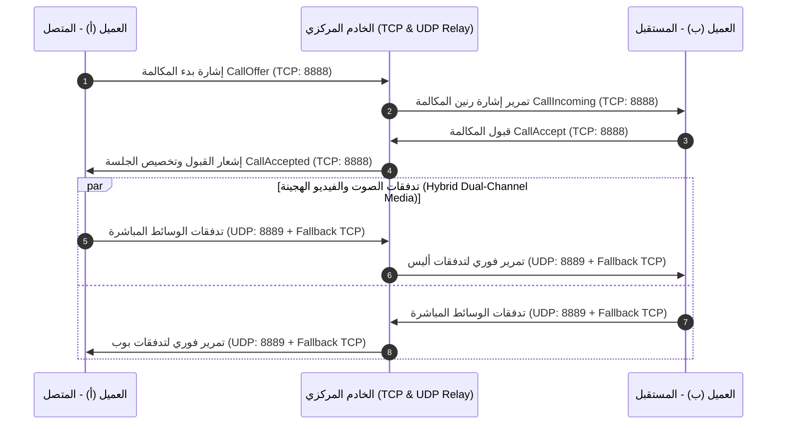

# الدليل المعماري والتقني الشامل (ARCHITECTURE.md)
### نظام المراسلة والاتصالات المتقدم (SyncPulse / SecureTalk)
### وفق المعايير القياسية الدولية (ISO/IEC/IEEE 42010 & Clean Architecture)

---

## 1. المعمارية العامة للنظام (High-Level System Architecture)

النظام مبني بنمط **Centralized Client-Server** محلي بالكامل يدعم كلاً من الشبكات السلكية واللاسلكية وخطوط الاتصال المباشرة:

```text
[Client WPF GUI]  <--- TCP: 8888 (Control / Messages / Signaling)  --->  [Server WPF GUI & Core]
[Client WPF GUI]  <--- UDP: 8889 (Voice / Video Media Relay Stream) --->  [Server UDP Media Relay]
[Client UDP Auto] <--- UDP: 8887 (Wi-Fi Multi-Subnet Auto-Discovery) <--  [Server Broadcaster]
```

---

## 2. معمارية تدفقات الوسائط والمكالمات (Real-Time Media Subsystem Architecture)



---

## 3. تركيبة ترويسة الحزم الثنائية (12-Byte FrameHeader Layout)

```text
 0                   1                   2                   3
 0 1 2 3 4 5 6 7 8 9 0 1 2 3 4 5 6 7 8 9 0 1 2 3 4 5 6 7 8 9 0 1
+-+-+-+-+-+-+-+-+-+-+-+-+-+-+-+-+-+-+-+-+-+-+-+-+-+-+-+-+-+-+-+-+
|  Magic (0x53) | Version (0x01)|      PacketType (16-bit)      |
+-+-+-+-+-+-+-+-+-+-+-+-+-+-+-+-+-+-+-+-+-+-+-+-+-+-+-+-+-+-+-+-+
|                      PayloadLength (32-bit)                   |
+-+-+-+-+-+-+-+-+-+-+-+-+-+-+-+-+-+-+-+-+-+-+-+-+-+-+-+-+-+-+-+-+
|                     SequenceNumber (32-bit)                   |
+-+-+-+-+-+-+-+-+-+-+-+-+-+-+-+-+-+-+-+-+-+-+-+-+-+-+-+-+-+-+-+-+
```

---

## 4. تصميم محرك الصوت الآمن (Zero-Allocation Pre-Pinned Ring Buffers)

```text
                        +---------------------------------------+
                        |  PlayAudioChunk(pcmData) (16000 Hz)   |
                        +---------------------------------------+
                                           |
                                           v
                       +-----------------------------------------+
                       | BlockCopy to _outBuffers[RingIndex]     |
                       | (Pre-Pinned in Memory - Zero Allocation)|
                       +-----------------------------------------+
                                           |
                                           v
                       +-----------------------------------------+
                       | Update WAVEHDR dwBufferLength           |
                       | waveOutWrite(_hWaveOut, _pOutHeaders)   |
                       +-----------------------------------------+
                                           |
                                           v
                       +-----------------------------------------+
                       | RingIndex = (RingIndex + 1) % 8         |
                       | (Zero 0xc0000005 Crashes / High HD)     |
                       +-----------------------------------------+
```

---

## 5. قاعدة البيانات المركزية (SQLite 3NF Schema)

* `USERS`: المستخدمين، كلمات المرور المشفرة بـ PBKDF2/SHA-256، والـ Salt.
* `USER_CONTACTS`: جهات الاتصال المحفوظة والأسماء المخصصة.
* `USER_SESSIONS`: الجلسات النشطة، عناوين الـ IP، وتوكنات الـ JWT.
* `DIRECT_CONVERSATIONS`: المحادثات الثنائية المباشرة (User1_ID, User2_ID).
* `MESSAGES`: سجل الرسائل، المرفقات، وحالات التسليم (0: Sent ✓, 1: Delivered ✓✓, 2: Read).
* `CALL_RECORDS`: سجل المكالمات الصوتية والمرئية، مدة المكالمة بالثواني، وحالة الإنهاء.
* `SERVER_AUDIT_LOGS`: سجلات تدقيق وأحداث الخادم اللحظية.

---

## المراجع (References - APA 7th Edition)

1. Bass, L., Clements, P., & Kazman, R. (2021). *Software Architecture in Practice* (4th ed.). Addison-Wesley Professional.
2. Martin, R. C. (2017). *Clean Architecture: A Craftsman's Guide to Software Structure and Design*. Prentice Hall.
3. Postel, J. (1981). *Transmission Control Protocol* (RFC 793). Internet Engineering Task Force. https://doi.org/10.17487/RFC0793
