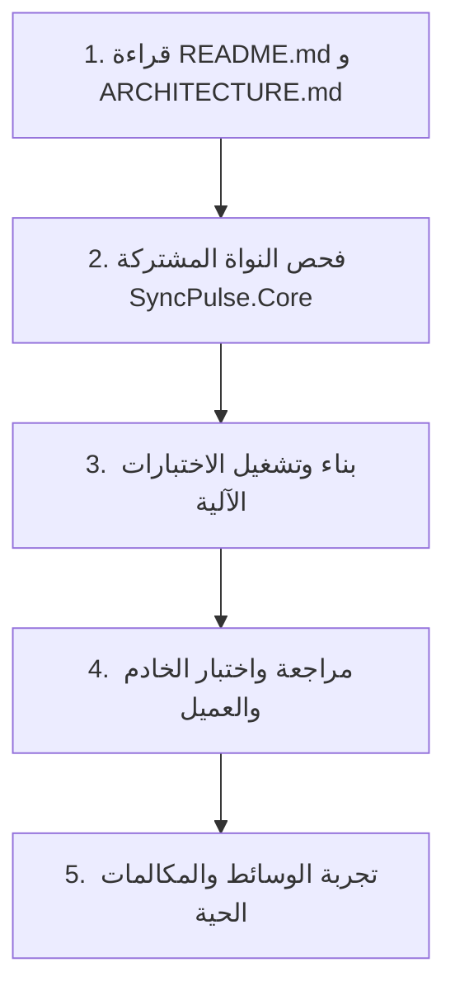

# دليل مراجعة وتدقيق النظام (REVIEW_GUIDE.md)
### لنظام المراسلة والاتصالات المتقدم (SyncPulse / SecureTalk)
### إرشادات المراجعة لمدير المشروع (PM)، كبير المهندسين (Lead Architect)، والمطورين (Developers)
### وفق المعايير القياسية الدولية (ISO/IEC/IEEE 12207, ISO 25010, & APA 7th Edition)

---

## 1. مسار مراجعة مدير المشروع وكبير المهندسين (Project Manager & Tech Lead Review)

عندما يقوم مدير المشروع أو كبير المهندسين بمراجعة النظام، فإنه يركز على **الامتثال المعماري، سلامة المعايير، واستقرار النظام** من خلال الخطوات الأربع التالية:

### الخطوة 1: فحص وثائق الحوكمة والمعايير الدولية
1. الاطلاع على [`AGENTS.md`](file:///d:/IT%20FILES/level%204/%D8%AE%D8%A7%D8%AF%D9%85%20%D9%88%D8%B9%D9%85%D9%8A%D9%84/%D9%86%D8%B8%D8%B1%D9%8A/%D8%A7%D9%84%D9%85%D8%B4%D8%B1%D9%88%D8%B9/%D9%85%D8%B4%D8%B1%D9%88%D8%B9%20%D8%A7%D9%84%D9%85%D8%B4%D8%B1%D9%88%D8%B9/%D9%85%D8%B4%D8%B1%D9%88%D8%B9%20%D8%A7%D9%84%D9%85%D8%B1%D8%A7%D8%B3%D9%84%D9%87%20%D9%88%D8%A7%D9%84%D8%A7%D8%AA%D8%B5%D8%A7%D9%84%D8%A7%D8%AA/AGENTS.md) للتحقق من التزام الفريق بميثاق منع الانهيار وعزل الفروع.
2. مراجعة [`TECH_STACK.md`](file:///d:/IT%20FILES/level%204/%D8%AE%D8%A7%D8%AF%D9%85%20%D9%88%D8%B9%D9%85%D9%8A%D9%84/%D9%86%D8%B8%D8%B1%D9%8A/%D8%A7%D9%84%D9%85%D8%B4%D8%B1%D9%88%D8%B9/%D9%85%D8%B4%D8%B1%D9%88%D8%B9%20%D8%A7%D9%84%D9%85%D8%B4%D8%B1%D9%88%D8%B9/%D9%85%D8%B4%D8%B1%D9%88%D8%B9%20%D8%A7%D9%84%D9%85%D8%B1%D8%A7%D8%B3%D9%84%D9%87%20%D9%88%D8%A7%D9%84%D8%A7%D8%AA%D8%B5%D8%A7%D9%84%D8%A7%D8%AA/TECH_STACK.md) لمطابقة المتطلبات الوظيفية مع التقنيات والمحركات المختارة.
3. مراجعة [`CHANGELOG.md`](file:///d:/IT%20FILES/level%204/%D8%AE%D8%A7%D8%AF%D9%85%20%D9%88%D8%B9%D9%85%D9%8A%D9%84/%D9%86%D8%B8%D8%B1%D9%8A/%D8%A7%D9%84%D9%85%D8%B4%D8%B1%D9%88%D8%B9/%D9%85%D8%B4%D8%B1%D9%88%D8%B9%20%D8%A7%D9%84%D9%85%D8%B4%D8%B1%D9%88%D8%B9/%D9%85%D8%B4%D8%B1%D9%88%D8%B9%20%D8%A7%D9%84%D9%85%D8%B1%D8%A7%D8%B3%D9%84%D9%87%20%D9%88%D8%A7%D9%84%D8%A7%D8%AA%D8%B5%D8%A7%D9%84%D8%A7%D8%AA/CHANGELOG.md) للتحقق من المراجع الأكاديمية (APA 7) وتتبع الإصدارات.

### الخطوة 2: تشغيل حزمة الفحص الآلي الشامل (Automated Quality Gate)
تنفيذ أمر الاختبار الشامل للتأكد من نجاح الـ 62 اختباراً دون أي خطأ:
```bash
dotnet run --project SyncPulse.Tests/SyncPulse.Tests.csproj
```
- يجب أن تظهر رسالة: `ALL 62 TESTS PASSED SUCCESSFULLY! (0 Failures)`.

### الخطوة 3: التحقق من معايير عدم الانهيار والأمان (Non-Functional Requirements)
- **Zero-Crash Policy:** التحقق من عدم وجود `.Result` أو `.Wait()` في أي دالة شبكية أو قاعدة بيانات.
- **Bulkhead Pattern:** التأكد من إحاطة كل عميل في `ClientSession.cs` بـ `try-catch-finally` مستقل.
- **Memory Safety:** التحقق من استخدام المخازن الدائرية الثابتة `Zero-Allocation Ring Buffers` في `AudioEngine.cs` لمنع خطأ `0xc0000005`.
- **Data Protection:** التأكد من عدم تخزين كلمات المرور كنص صريح واستخدام `CryptoEngine.HashPassword` مع `Salt`.

---

## 2. مسار مراجعة المطور العادي (Developer / Peer Review)

عندما يأتي أي مطور برمجيات جديد لفهم الكود والمساهمة فيه، يتبع الخطوات السريعة التالية:



### الخطوة 1: بناء الحل البرمجي بالكامل (Build Solution)
```bash
dotnet build SyncPulse.sln
```
*التأكد من خلو المشروع من أي أخطاء تجميع (`0 Errors`).*

### الخطوة 2: فهم العقد المشترك أولاً (`SyncPulse.Core`)
يبدأ المطور بالاطلاع على:
- `FrameHeader.cs`: لفهم ترويسة الحزم ذات الـ 12 بايت وترتيب البايتات Big-Endian.
- `Packets/`: للتعرف على كائنات البيانات المتبادلة (Auth, Messages, Calls, Media, Contacts).

### الخطوة 3: استكشاف طبقة الخادم (`SyncPulse.Server`)
- `Data/`: لفهم مخطط SQLite 3NF والعمليات المتاحة في المستودعات (Repositories).
- `Engine/`: لفهم كيفية استقبال وإرسال المقابس TCP و UDP Media Relay.
- `ViewModels/`: لفهم كيفية ربط الواجهة XAML بالأحداث عبر نمط MVVM.

### الخطوة 4: تجربة منظومة العميل والوسائط (`SyncPulse.Client`)
1. **عرض وسائط تليجرام:** إرسال صورة أو ملف صوتي والتأكد من ظهورهما المباشر في فقاعة المحادثة.
2. **المكالمات الفورية:** تجربة مكالمة فيديو والتأكد من ظهور المعاينة الذاتية (PiP) وتدفق فيديو المستقبل مع إطفاء ضوء الكاميرا الحقيقي عند كتمها.

---

## المراجع (References - APA 7th Edition)

1. Bass, L., Clements, P., & Kazman, R. (2021). *Software Architecture in Practice* (4th ed.). Addison-Wesley Professional.
2. International Organization for Standardization. (2017). *Systems and software engineering — Software life cycle processes* (ISO/IEC/IEEE 12207:2017). ISO.
3. Martin, R. C. (2017). *Clean Architecture: A Craftsman's Guide to Software Structure and Design*. Prentice Hall.
