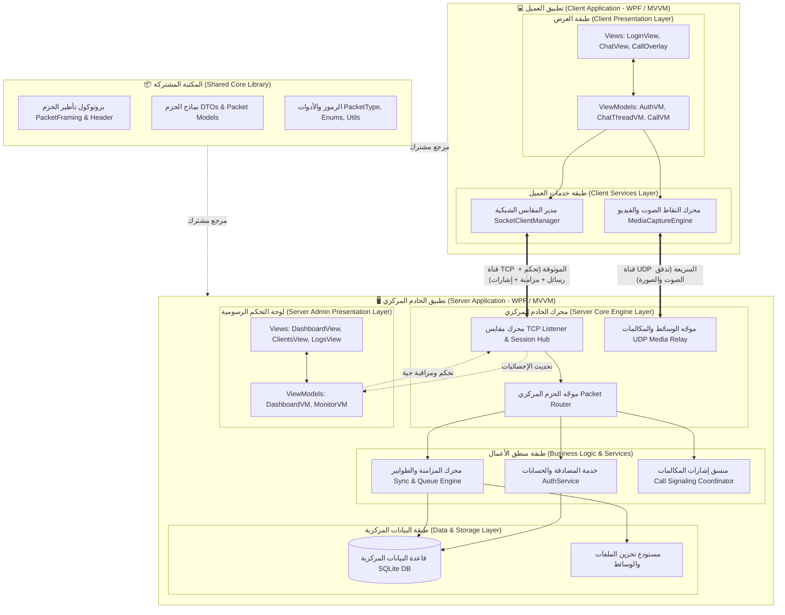
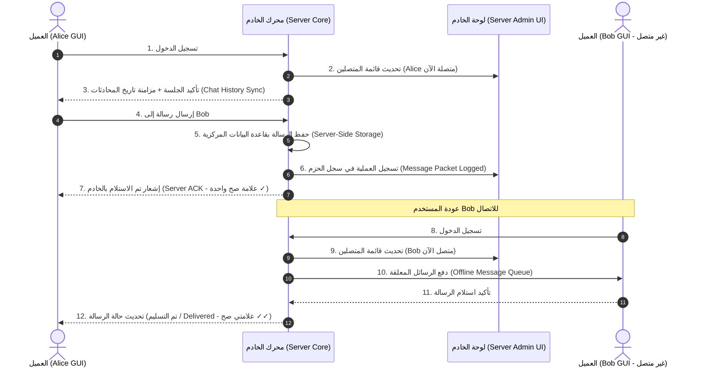

# مقترح مشروع SecureTalk: نظام المراسلة والاتصالات المحلي المركزي

---

## 1. عنوان المشروع

### **SecureTalk: نظام محلي متكامل للمراسلة الفورية والاتصال الصوتي والمرئي الفردي (One-to-One Calls) بواجهات رسومية (GUI Server & Client) ومعمارية مركزية مستوحاة من منصة Telegram**

---

## 2. الملخص التنفيذي (Executive Summary)

يقدم مشروع **SecureTalk** نموذجاً تطبيقياً متكاملاً لنظام اتصال ومراسلة داخلي يعمل عبر **الشبكات السلكية (Ethernet LAN) والشبكات اللاسلكية المحلية (Local Wi-Fi / WLAN & Hotspots)** دون الحاجة إلى إنترنت، مع ميزة الاكتشاف التلقائي للخادم (Auto-Discovery). يرتكز النظام على معمارية العميل والخادم (Client-Server Architecture) باستخدام لغة **#C** ومنصة **8 NET.** مع واجهات مستخدم رسومية تفاعلية حديثة لكلا الطرفين (**WPF - GUI لكلا الخادم والعميل**) وعبر البرمجة الشبكية المباشرة (**Socket Programming**). 

يتبنى النظام فلسفة شبيهة بمنصة **Telegram**، حيث يُصمّم **الخادم كعقل مركزي (Server-Centric / Thick GUI Server)** يمتلك لوحة تحكم رسومية إدارية لمراقبة النشاط والتحكم بالشبكة، ويدير كافة العمليات محلياً: المصادقة، وتخزين الرسائل والوسائط، ومزامنة سجل المحادثات (Chat History Sync)، وإدارة المستخدمين والجلسات، وتوجيه **المكالمات الصوتية والمرئية الفردية (One-to-One P2P Calls via Server)**، بينما يعمل **العميل (Client GUI)** كواجهة دردشة واتصال تفاعلية وسريعة مبنية وفق نمط **MVVM**.

---

## 3. مشكلة المشروع (Problem Statement)

في كثير من بيئات العمل المغلقة والمؤسسات التعليمية والمختبرات والمرافق ذات الخصوصية العالية، تبرز الحاجة إلى نظام تواصل محلي يعمل بكفاءة عبر الكابلات السلكية (LAN) أو شبكات الواي فاي المحلية ونقاط الاتصال المباشرة (Wi-Fi Hotspots) دون الاعتماد على خوادم سحابية خارجية، مع توفير واجهة رسومية لإدارة ومراقبة الخادم بدلاً من الشاشات الطرفية الصامتة:

1. **صعوبة مراقبة وإدارة الخوادم الطرفية (CLI/Headless vs. GUI Server):** غياب واجهة رسومية تفاعلية للخادم يصعّب على مسؤولي الشبكة مراقبة العملاء المتصلين، ورؤية تدفق البيانات المباشر، وضبط إعدادات الشبكة والجلسات بصورة مرئية ميسرة.
2. **تشتت التخزين والاتصال في الشبكات اللاسلكية والمحلية:** ضياع الرسائل عند انقطاع الاتصال اللاسلكي اللحظي أو عدم تواجد المستقبل لحظة الإرسال لغياب خادم مركزي ذكي يحتفظ بسجل الرسائل والمزامنة التلقائية.
3. **صعوبة الإعداد اليدوي لعناوين IP على شبكات الواي فاي:** الحاجة لآلية اكتشاف تلقائي ذكية تمكّن تطبيقات العميل على أجهزة الواي فاي من العثور على الخادم والاتصال به فوراً.

---

## 4. أهداف المشروع (Project Objectives)

1. **تطوير تطبيق خادم مركزي ذي واجهة رسومية تفاعلية (GUI Server Application):**
   - واجهة إدارية حديثة (WPF Admin Dashboard) لإدارة الخادم، والتحكم بالتشغيل/الإيقاف، ومراقبة حركة الحزم الشبكية.
   - استماع شامل على كافة بطاقات الشبكة (Ethernet & Wi-Fi: `0.0.0.0`) مع بث إشارات الاكتشاف التلقائي.
2. **بناء عميل دردشة واتصال مرئي تفاعلي (Rich Client GUI):**
   - واجهة مستخدم عصرية (WPF / MVVM) تدعم الاكتشاف التلقائي للخادم عبر شبكة الواي فاي المحلية، وتتيح المراسلة الفردية المباشرة وإجراء المكالمات الفردية.
3. **تطبيق آلية مزامنة مركزية مستوحاة من Telegram (Telegram-like Message Sync):**
   - استمرارية الرسائل: تخزين المحادثات الفردية بالخادم لتسليمها فور اتصال المستخدم (Online/Offline Sync) والتعافي التلقائي عند تذبذب شبكة الواي فاي.
   - توفير نظام المحادثات الفردية المباشرة وسجل المحادثات المركزي.
4. **تضمين الاتصال الصوتي والمرئي الفردي حصراً:** توفير قناة اتصال وسائط متعددة فردية ومباشرة بين طرفين (One-to-One Calling Only) تدار وتوجّه عبر الخادم بواسطة قنوات UDP Media Relay.
5. **تحقيق الأمان والاستقرار الشبكي:** بروتوكول تأطير مخصص (TCP Frame Header) وتشفير محلي لحماية البيانات داخل الشبكة السلكية واللاسلكية.

---

## 5. معمارية النظام وآلية العمل (System Architecture)
### وفق المعيار القياسي الدولي (ISO/IEC/IEEE 42010 & The C4 Model / 4+1 Architectural View Model)

تعتمد المعمارية على النماذج القياسية المعتمدة عالمياً في هندسة البرمجيات، عبر الجمع بين **C4 Model** لتوضيح مستويات التجريد، ونموذج **4+1 View Model** لتفصيل الرؤى المنطقية والعملياتية والتطويرية:

### 5.2 تفصيل الطبقات المعمارية (Layered Architecture Breakdown)

#### أولاً: قسم تطبيق الخادم (The GUI Server Application)
* **طبقة العرض الإدارية (Admin UI):** لوحة تحكم رسومية بـ **WPF/MVVM** للتحكم بتشغيل/إيقاف الخدمة، مراقبة العملاء المتصلين، ومتابعة سجل الحزم الشبكية واستهلاك الموارد لحظياً.
* **محرك الخادم ومنطق الأعمال (Server Core & Business Engine):** إدارة اتصالات TCP متعددة الخيوط، وتمرير تدفقات الوسائط عبر UDP Relay، ومعالجة المصادقة وتشفير كلمات المرور.
* **محرك المزامنة وقاعدة البيانات (Sync Engine & Data Store):** حفظ دائم لكافة الرسائل والوسائط في قاعدة بيانات مركزية (`SQLite`) مع إدارة طوابير الانتظار لتسليم الرسائل للمستخدمين غير المتصلين فور عودتهم (Telegram-like Model).

#### ثانياً: قسم تطبيق العميل (The GUI Client Application)
* **طبقة العرض التفاعلية (Client UI):** واجهة مستخدم حديثة بـ **WPF/MVVM** للمراسلة الفردية المباشرة وإجراء المكالمات الفردية.
* **طبقة خدمات العميل (Client Services):** إدارة الاتصال بالمقبس، والتقاط الصوت والكاميرا، والتحديث اللحظي للواجهة دون حجب أو تجميد.

#### ثالثاً: المكتبة المشتركة (Shared Core Library)
* تمثل العقد الموحد (Contracts) متضمنة نماذج الحزم (Packets/DTOs)، بروتوكول تأطير الترويسة (Frame Header 12-Bytes)، والأدوات المساعدة (Enums & Utils).

---

## 6. التقنيات والأدوات المستخدمة

| المجال | التقنية / الأداة | الغرض والاستخدام |
| :--- | :--- | :--- |
| **لغة البرمجة والمنصة** | **#C و NET 8. LTS** | بناء كافة مكونات الخادم، العميل، والمكتبة المشتركة. |
| **واجهة الخادم (Server GUI)** | **WPF (MVVM Pattern)** | لوحة تحكم رسومية لإدارة النظام ومراقبة المتصلين وحركة الشبكة. |
| **واجهة العميل (Client GUI)** | **WPF (MVVM Pattern)** | واجهة دردشة ومكالمات تفاعلية وسلسة. |
| **الاتصال الشبكي** | **`System.Net.Sockets` (TCP)** | برمجة المقابس المباشرة (`TcpListener` للخادم و `TcpClient` للعميل). |
| **التزامن وإدارة الموارد** | **`async/await` و `ConcurrentDictionary`** | معالجة مئات الاتصالات المتزامنة دون تجميد واجهات المستخدم. |
| **بروتوكول التأطير (Framing)** | **IETF TLV / Fixed-Header (12-Byte Header + Big-Endian)** | معيار قياسي عالمي لضمان سلامة الحزم ومنع تداخل وتجزئة رسائل TCP. |
| **قاعدة البيانات المركزية** | **SQLite (مُدارة بالكامل داخل الخادم)** | تخزين الحسابات، سجل المحادثات، المجموعات، وحالات التسليم. |
| **الوسائط والمكالمات** | **`NAudio` + `DirectShow` / `OpenCvSharp`** | التقاط وبث الصوت والفيديو محلياً تحت إدارة وتوجيه الخادم. |
| **الأمان المحلي** | **`SslStream` / تشفير محلي** | تأمين الاتصال بين واجهة العميل والخادم داخل الشبكة المحلية. |
| **التوثيق وإدارة الإصدارات** | **Git, GitHub, Markdown, Mermaid** | التوثيق المعماري ومتابعة النسخ البرمجية. |

---

## 7. آلية العمل الشبيهة بتلغرام (Telegram-like Mechanism)

---

## 8. الخطة الزمنية المقترحة لتنفيذ المشروع (Gantt Schedule)

| المرحلة / النشاط | أ1-أ2 | أ3-أ4 | أ5-أ6 | أ7-أ8 | أ9-أ10 | أ11-أ12 |
| :--- | :---: | :---: | :---: | :---: | :---: | :---: |
| **1. التحليل وتصميم بروتوكول التخاطب والمكتبة المشتركة** | █ | | | | | |
| **2. بناء محرك الخادم، قاعدة البيانات المركزية، وواجهة تحكم الخادم (Server GUI)** | | █ | | | | |
| **3. تطبيق منطق المراسلة والمزامنة الشبيه بتلغرام وطوابير الانتظار** | | | █ | | | |
| **4. بناء واجهة العميل (Client GUI / WPF) وربطها بالخادم** | | | | █ | | |
| **5. تنفيذ وتوجيه المكالمات الصوتية والمرئية وعرضها بالواجهات** | | | | | █ | |
| **6. اختبار الأداء الميداني، معالجة الأخطاء، والتوثيق النهائي** | | | | | | █ |

---

## 9. توزيع المسؤوليات المقترح لفريق العمل

| الرقم | الدور | المهام والمسؤوليات |
| :---: | :--- | :--- |
| **1** | **مهندس الخادم وقواعد البيانات** | بناء محرك الخادم، اتصالات TCP، قاعدة البيانات المركزية SQLite، ومحرك المزامنة. |
| **2** | **مطور واجهة الخادم (Server GUI Developer)** | تصميم لوحة تحكم الخادم الإدارية (Dashboard)، شاشة المتصلين، وعارض السجل المباشر. |
| **3** | **مطور واجهة العميل (Client GUI Developer)** | تصميم واجهات الدردشة والمحادثات للمستخدم بنمط MVVM وإدارة التفاعل. |
| **4** | **مهندس بروتوكول الشبكة والأمان** | تصميم إطار الحزم (Packet Framing)، التشفير المحلي، والمصادقة. |
| **5** | **مهندس الوسائط وضمان الجودة** | برمجة تدفقات الصوت والفيديو وتكاملها مع الواجهات، وإجراء اختبارات الأداء والتوثيق. |

---

## 10. المراجع والمعايير القياسية المعتمدة (References & Standards - APA 7)

- **Comer, D. E. (2018).** *Computer networks and internets* (6th ed.). Pearson.
- **Fette, I., & Melnikov, A. (2011).** *The WebSocket Protocol* (RFC 6455). Internet Engineering Task Force (IETF). https://doi.org/10.17487/RFC6455
- **Institute of Electrical and Electronics Engineers. (2011).** *Systems and software engineering — Architecture description* (ISO/IEC/IEEE Standard No. 42010:2011). IEEE. https://standards.ieee.org/standard/42010-2011.html
- **Institute of Electrical and Electronics Engineers. (2018).** *Systems and software engineering — Requirements engineering* (ISO/IEC/IEEE Standard No. 29148:2018). IEEE. https://standards.ieee.org/standard/29148-2018.html
- **International Organization for Standardization. (2011).** *System and software quality models* (ISO/IEC Standard No. 25010:2011). ISO. https://www.iso.org/standard/35733.html
- **Jones, M., Bradley, J., & Sakimura, N. (2015).** *JSON Web Token (JWT)* (RFC 7519). IETF. https://doi.org/10.17487/RFC7519
- **Microsoft Corporation. (2024a).** *Sockets in .NET: Socket services and asynchronous programming*. Microsoft Learn. https://learn.microsoft.com/en-us/dotnet/fundamentals/networking/sockets/socket-services
- **Microsoft Corporation. (2024b).** *Model-View-ViewModel (MVVM) pattern in WPF applications*. Microsoft Learn. https://learn.microsoft.com/en-us/dotnet/desktop/wpf/data/data-binding-overview
- **National Institute of Standards and Technology. (2020).** *Digital Identity Guidelines* (NIST SP 800-63B). U.S. Department of Commerce. https://doi.org/10.6028/NIST.SP.800-63b
- **Object Management Group. (2015).** *OMG Unified Modeling Language (OMG UML) Specification* (Version 2.5). OMG. https://www.omg.org/spec/UML/2.5/
- **Rescorla, E. (2018).** *The Transport Layer Security (TLS) Protocol Version 1.3* (RFC 8446). IETF. https://doi.org/10.17487/RFC8446
- **Richter, J. (2012).** *CLR via C#* (4th ed.). Microsoft Press.
- **Tanenbaum, A. S., & Wetherall, D. J. (2021).** *Computer networks* (6th ed.). Pearson.
- **Telegram FZ-LLC. (2024).** *Telegram MTProto Mobile Protocol and Cloud-based Messaging Architecture*. Telegram Core Documentation. https://core.telegram.org/mtproto
