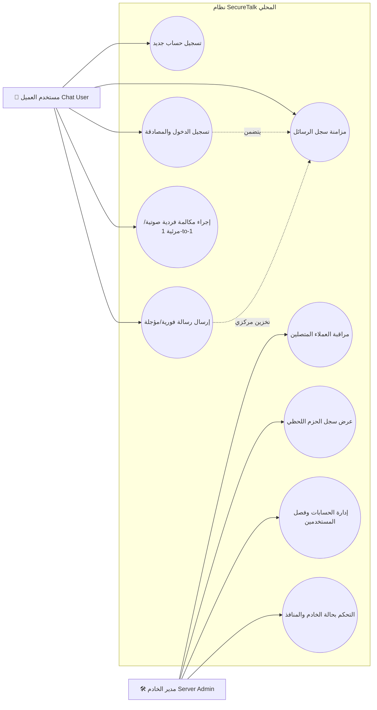
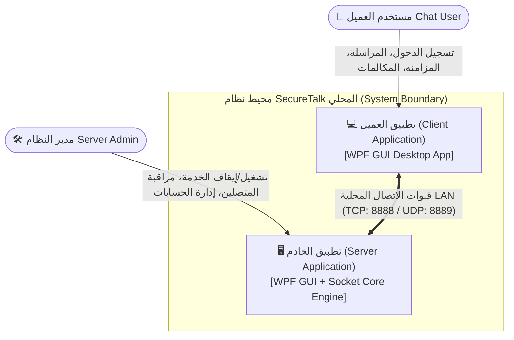
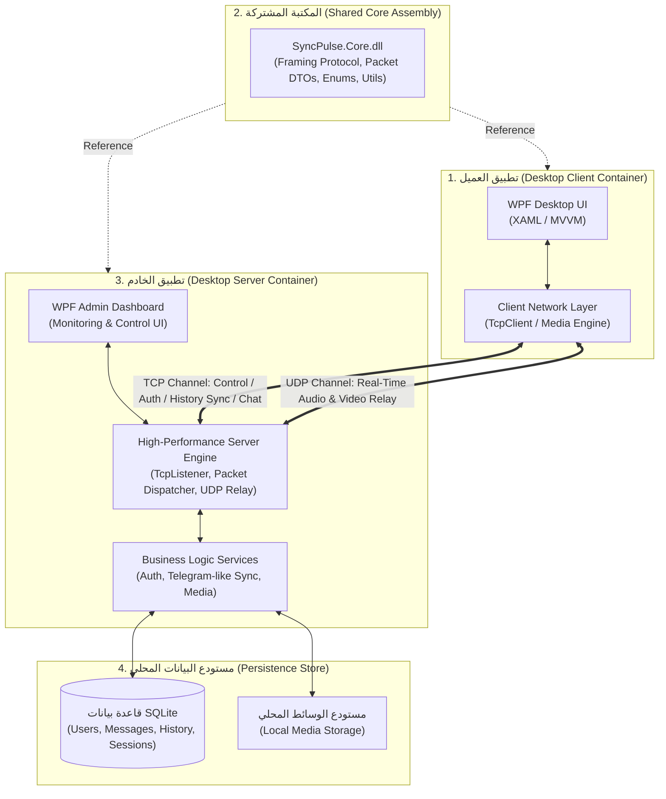
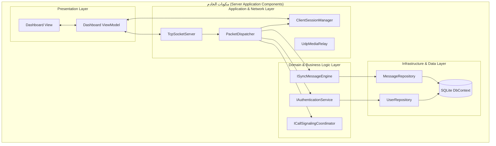
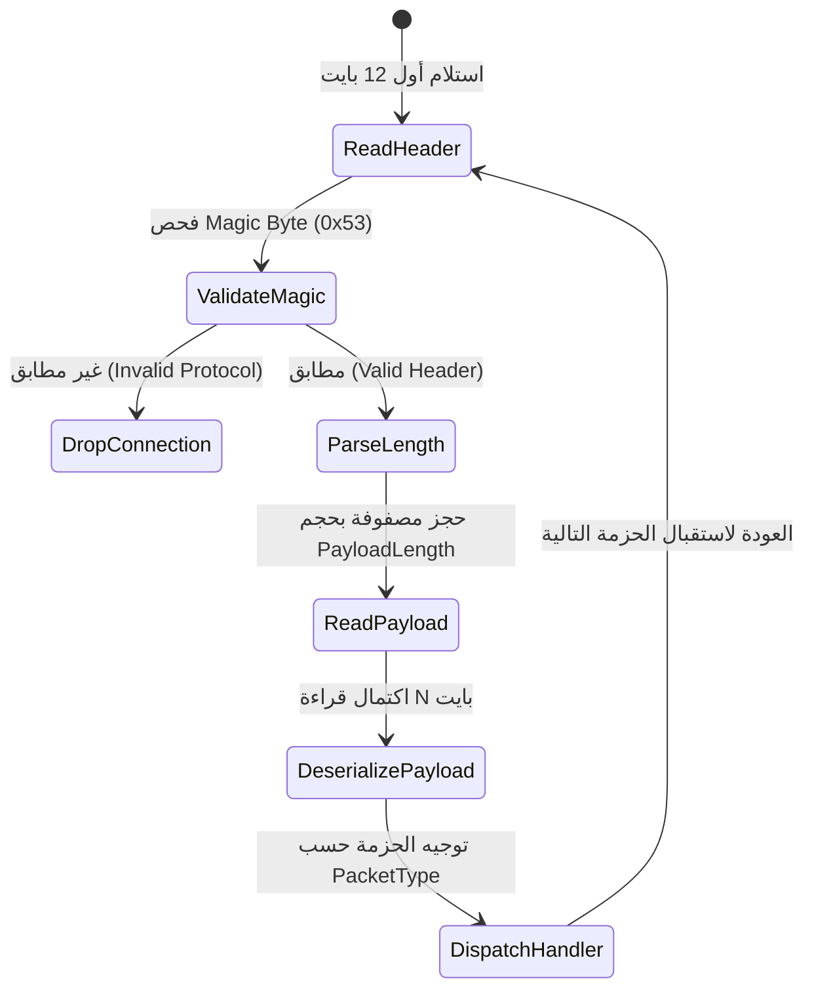
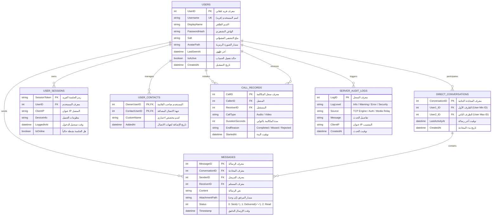
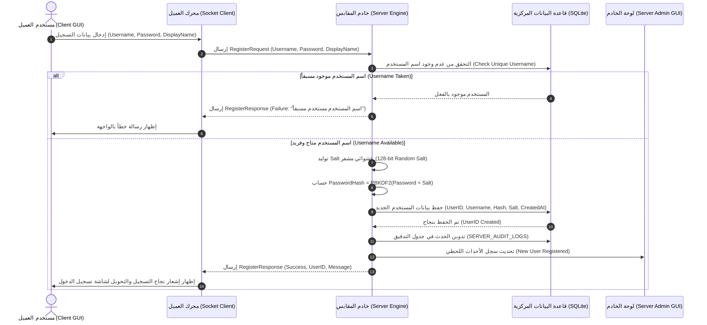
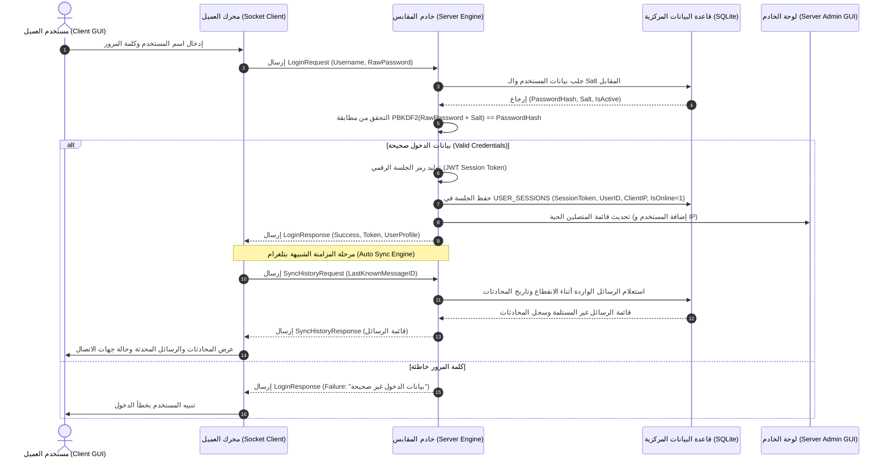
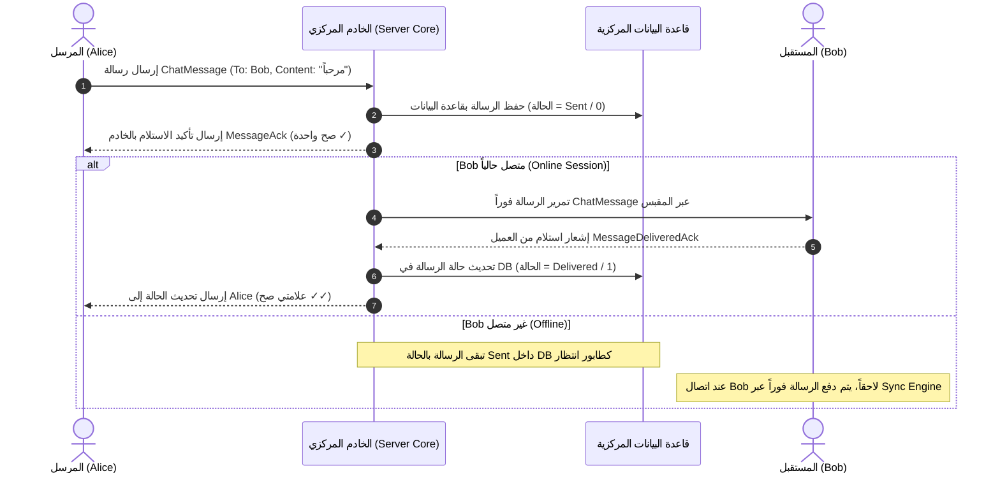
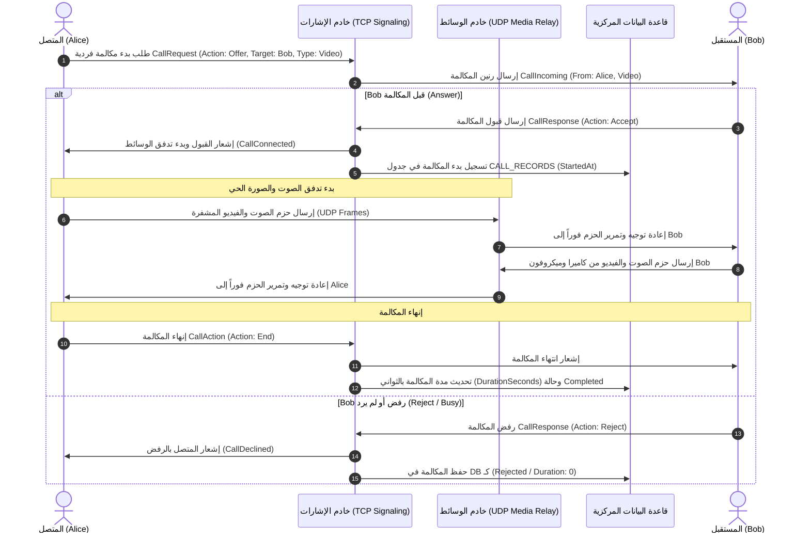

# وثيقة التحليل والتصميم الهندسي لنظام المراسلة والاتصالات المحلي (SecureTalk)

### Software Requirements & System Design Document (SRDD)

---

## 1. المقدمة ونطاق النظام (Introduction & Scope)

### 1.1 الغرض من الوثيقة

تهدف هذه الوثيقة إلى توفير مرجع هندسي شامل ومفصل لعمليات **تحليل وتصميم النظم** لنظام **SecureTalk**. توثق هذه الوثيقة المتطلبات الوظيفية وغير الوظيفية، ومخططات حالات الاستخدام، والمعمارية البرمجية، وتصميم بروتوكول الشبكة، ومخطط قاعدة البيانات، وتصميم الواجهات الرسومية لكل من الخادم والعميل.

### 1.2 نطاق النظام والبيئة الشبكية (System Scope & Network Environment)

نظام **SecureTalk** هو تطبيق اتصال ومراسلة محلي شامل بمعمارية **Client-Server** مركزية مستوحاة من منصة **Telegram**.

- **بيئة العمل الشبكية:**
  1. **الشبكات السلكية المحلية (Ethernet LAN).**
  2. **الشبكات اللاسلكية المحلية (Local Wi-Fi / WLAN).**
  3. **نقاط الاتصال اللاسلكية المباشرة (Local Wi-Fi Hotspots / Ad-Hoc).**
- **آلية الربط والاكتشاف:**
  - استماع الخادم على كافة بطاقات الشبكة (`IPAddress.Any` / `0.0.0.0`) لدعم بطاقات الإيثرنت والواي فاي في آن واحد.
  - دعم خاصية **الاكتشاف التلقائي للخادم (Auto-Discovery via UDP Broadcast/Multicast)** لتمكين أجهزة العميل المتصلة عبر الواي فاي من العثور على عنوان الخادم والاتصال به دون الحاجة لإدخال عنوان IP يدوياً.
- **الهيكلية الأساسية:**
  1. تطبيق خادم ذو واجهة رسومية إدارية (**Server GUI**).
  2. تطبيق عميل ذو واجهة رسومية للمستخدمين (**Client GUI**).
  3. مكتبة مشتركة للعقود والبروتوكول (**Shared Core**).

---

### 1.3 مصفوفة المعايير والمواصفات القياسية الدولية المعتمدة (International Standards Matrix)

يلتزم تصميم وتطوير نظام **SecureTalk** بالمعايير القياسية الدولية المعتمدة من كبرى منظمات هندسة البرمجيات والشبكات والأمن:

| المجال الهندسي                                            | المعيار القياسي الدولي المعتمد     | المنظمة المصدرة | التطبيق الفعلي في النظام                                                                                                                          |
| :--------------------------------------------------------------------- | :------------------------------------------------------------ | :---------------------------: | :--------------------------------------------------------------------------------------------------------------------------------------------------------------------- |
| **هندسة وتوثيق المتطلبات**                   | **ISO/IEC/IEEE 29148:2018 / IEEE 830**                  |          ISO / IEEE          | صياغة المتطلبات الوظيفية وغير الوظيفية بمعرفات فريدة ومعايير قياس واختبار محددة.                  |
| **التصميم المعماري البرمجي**               | **ISO/IEC/IEEE 42010:2011 & The 4+1 View Model**        |        IEEE / Kruchten        | توثيق الرؤى المعمارية (المنطقية، العمليات، التطوير، النشر المادي، والسيناريوهات).                |
| **التجريد المعماري والمكونات**           | **The C4 Model (Context, Containers, Components)**      |       Simon Brown / C4       | رسم وتوثيق مكونات النظام من المستوى الكلي حتى مستوى الكلاسات.                                                       |
| **تأطير البروتوكول وحزم الشبكة**        | **IETF RFC 6455 / RFC 7540 (TLV Framing)**              |             IETF             | تقسيم الحزم إلى ترويسة ثابتة (12-Bytes) وحمولة متغيرة لمنع تجزئة وتداخل بيانات TCP.                           |
| **ترتيب بايتات الشبكة**                         | **IETF RFC 1700 (Network Byte Order - Big-Endian)**     |             IETF             | تشفير وفك تشفير الأعداد الثنائية بترتيب Big-Endian لمنع اختلاف المنصات والمعالجات.                        |
| **أمن المصادقة وتجزئة كلمات المرور** | **NIST SP 800-63B & NIST SP 800-132**                   |             NIST             | استخدام خوارزميات التجزئة مع ملح عشوائي فريد لكل مستخدم لمنع هجمات Rainbow Tables.                             |
| **إدارة الجلسات ورموز الأمان**            | **IETF RFC 7519 (JSON Web Tokens - JWT)**               |             IETF             | إصدار والتحقق من رموز الجلسات المؤقتة المشفرة للتحقق المستمر من هوية العميل.                           |
| **أمن الاتصال والنقل الشبكي**              | **IETF RFC 8446 (TLS 1.3 Protocol) / SslStream**        |             IETF             | تشفير تدفقات TCP محلياً لحماية الرسائل من التنصت داخل شبكة الواي فاي.                                            |
| **تصميم قواعد البيانات**                       | **Codd's Third Normal Form (3NF) & ISO/IEC 9075 (SQL)** |          ANSI / ISO          | نمذجة العلاقات بجداول منقحة في الدرجة المعيارية الثالثة لمنع تكرار البيانات مع فهارس ذكية. |
| **معايير جودة البرمجيات (NFRs)**              | **ISO/IEC 25010 (SQuaRE Quality Model)**                |           ISO / IEC           | ضبط معايير الأداء، التزامن، الموثوقية، استهلاك الموارد، وسهولة الاستخدام.                              |
| **النمذجة والرسومات الهندسية**           | **OMG UML 2.5 (Unified Modeling Language)**             |              OMG              | رسم مخططات حالات الاستخدام، مخططات التسلسل، ومخططات الكيانات والعلاقات.                                  |
| **تصميم واجهات المستخدم**                     | **Microsoft Enterprise WPF MVVM & ISO 9241-110**        |        Microsoft / ISO        | فصل واجهات العرض عن المنطق لضمان عدم تجميد الواجهات أثناء العمليات الشبكية.                             |
| **التوثيق الأكاديمي والاستشهادات**   | **APA 7th Edition**                                     |              APA              | صياغة المراجع والمصطلحات العلمية وفق أحدث معايير جمعية علم النفس الأمريكية.                            |

---

## 2. مصفوفة أصحاب المصلحة والممثلين (Stakeholders & Actors)

| الفاعل (Actor)                                   | الوصف                                                                      | المسؤوليات والصلاحيات                                                                                                                                                                     |
| :----------------------------------------------------- | :------------------------------------------------------------------------------ | :------------------------------------------------------------------------------------------------------------------------------------------------------------------------------------------------------------ |
| **مدير الخادم (System Admin)**         | المشرف الفني على تشغيل خدمة الخادم.                | تشغيل/إيقاف الخدمة، مراقبة المتصلين، فحص سجل الحزم اللحظي، إدارة الحسابات، وطرد/حظر المستخدمين.                              |
| **مستخدم العميل (Chat User)**        | المستخدم النهائي لتطبيق المراسلة والاتصال. | تسجيل الحساب، المراسلة الفردية المباشرة، مزامنة المحادثات الفردية، وإجراء المكالمات الصوتية والمرئية الفردية. |
| **الخادم المركزي (Central Engine)** | الممثل الآلي المحوري في النظام.                       | التحقق، حفظ واسترجاع الرسائل من DB، إدارة طوابير المزامنة، وتمرير تدفقات الوسائط.                                                          |

---

## 3. هندسة المتطلبات (Requirements Engineering)

### 3.1 المتطلبات الوظيفية (Functional Requirements - FR)

#### أ. إدارة الحسابات والجلسات (Authentication & Account Management)

* **[FR-01]** إمكانية تسجيل حساب جديد من واجهة العميل مع التحقق من فرادة اسم المستخدم.
* **[FR-02]** تشفير وحفظ كلمات المرور في الخادم باستخدام خوارزميات التجزئة الآمنة (Hashing with Salt).
* **[FR-03]** دعم تسجيل الدخول وإصدار رموز الجلسات (Session Tokens) للتحقق المستمر.
* **[FR-04]** إمكانية إنشاء وتعديل وحظر وتفعيل الحسابات يدوياً من لوحة تحكم الخادم.

#### ب. المراسلة الفردية والمزامنة المركزية الشبيهة بتلغرام (1-to-1 Messaging & Telegram Sync)

* **[FR-05]** إرسال واستقبال الرسائل النصية الفردية والمباشرة حصراً بين طرفين (One-to-One Messaging Only) عبر قنوات TCP المباشرة.
* **[FR-06]** تخزين دائم لكافة المحادثات والرسائل الفردية في قاعدة بيانات الخادم المركزية (`SQLite`).
* **[FR-07]** المزامنة التلقائية (Direct History Sync): جلب سجل المحادثات الفردية والرسائل السابقة عند تسجيل الدخول من أي جهاز.
* **[FR-08]** طابور الرسائل المعلقة (Offline Message Queue): احتفاظ الخادم بالرسائل الموجهة للمستخدم المستهدف غير المتصل ودفعها فور عودته للاتصال.
* **[FR-09]** تحديث حالات الرسائل (Sent: علامة صح ✓ عند استلام الخادم، Delivered: علامتي صح ✓✓ عند استلام العميل المستهدف).
* **[FR-10]** إدارة قائمة جهات الاتصال والمحادثات الثنائية المباشرة (Direct Conversations Manager).

#### ج. الاتصال الصوتي والمرئي الفردي (One-to-One Audio/Video Calling)

* **[FR-11]** دعم إجراء المكالمات الفردية المباشرة حصراً بين طرفين (One-to-One Calling Only)، بما يشمل إرسال إشارات طلب المكالمة، والرنين، والقبول، والرفض، والإنهاء عبر قنوات التخاطب (TCP Signaling).
* **[FR-12]** التقاط الصوت من الميكروفون والصورة من الكاميرا وضغطها محلياً في طرفي المكالمة الفردية.
* **[FR-13]** بث وتوجيه تدفقات الوسائط المباشرة بين المتصلين الاثنين عبر مكرر الخادم (UDP Media Relay Engine).

#### د. إدارة ومراقبة الخادم (Server Monitoring & Administration GUI)

* **[FR-14]** لوحة تحكم رسومية لإدارة حالة خدمة المقابس (Start / Stop / Restart / Port Config).
* **[FR-15]** عارض حي للمتصلين وسجل تدفق الحزم الشبكية في الوقت الحقيقي (Real-Time Packet Stream).
* **[FR-16]** إحصائيات بصرية لاستهلاك موارد الخادم وعدد الرسائل والحزم الموجهة.

---

### 3.2 المتطلبات غير الوظيفية (Non-Functional Requirements - NFR)

### وفق المعيار القياسي الدولي لجودة البرمجيات (ISO/IEC 25010 SQuaRE Quality Model)

| الرمز         | خاصية الجودة (ISO 25010 Quality Attribute)                                             | المعيار والمقياس الهندسي المعتمد                                                                                                                                                                       |
| :----------------- | :------------------------------------------------------------------------------------------------ | :---------------------------------------------------------------------------------------------------------------------------------------------------------------------------------------------------------------------------------- |
| **[NFR-01]** | **كفاءة الأداء والسلوك الزمني (Performance - Time Behavior)**       | زمن تسليم الرسالة النصية محلياً$\le 50\text{ ms}$، وزمن استجابة إشارات المكالمات $\le 100\text{ ms}$.                                                                     |
| **[NFR-02]** | **استغلال السعة والتزامن (Capacity & Concurrency)**                     | قدرة الخادم على معالجة$+100$ اتصال متزامن بكفاءة عبر البرمجة غير المتزامنة (`async/await`) والمجموعات الآمنة للخيوط (`ConcurrentDictionary`). |
| **[NFR-03]** | **الموثوقية والقدرة على التعافي (Reliability & Fault Tolerance)** | ضمان عدم فقدان أي رسالة (Zero Data Loss) عند انقطاع اتصال العميل بفضل طابور الانتظار والتخزين المركزي الدائم في SQLite.                              |
| **[NFR-04]** | **السرية وسلامة البيانات (Security & Data Integrity)**                  | تشفير النقل المحلي بشهادات أمان (`SslStream`) والتحقق من صحة أطر الحزم لمنع هجمات التزييف والحقن.                                                            |
| **[NFR-05]** | **كفاءة استخدام الموارد (Resource Utilization)**                         | ألا يتجاوز استهلاك ذاكرة الخادم RAM حاجز$150\text{ MB}$ في أوقات الذروة، مع استخدام خيوط غير حاجبة (Non-blocking I/O).                                          |
| **[NFR-06]** | **قابلية الاستخدام وسهولة التفاعل (Usability & Ergonomics)**    | واجهات مستخدم متجاوبة بنمط WPF MVVM تتوافق مع مبادئ الحوار التفاعلي (ISO 9241-110).                                                                                               |
| **[NFR-07]** | **قابلية الصيانة وتعديل الكود (Maintainability - Modularity)**      | عزل الطبقات والمكونات واعتماد مكتبة مشتركة لتسهيل التوسع وإجراء اختبارات الوحدات المعزولة.                                                            |

---

## 4. نمذجة حالات الاستخدام (Use Case Modeling)



---

## 5. التصميم المعماري للنظام (System Architecture Design)

### وفق المعيار القياسي الدولي (ISO/IEC/IEEE 42010 & The C4 Model / 4+1 Architectural View Model)

تعتمد هيكلية النظام على النماذج المعمارية القياسية المعترف بها عالمياً في هندسة البرمجيات، وتحديداً نموذج **C4 Model** (Context, Containers, Components, Code) بالتكامل مع نموذج وجهات النظر المعمارية **4+1 View Model** (Logical, Process, Development, Physical views):

---

### 5.1 المستوى الأول: سياق النظام (Level 1: System Context Diagram - C4)

يوضح سياق تفاعل النظام مع المستخدمين وبيئة التشغيل المحلية (LAN Environment):



---

### 5.2 المستوى الثاني: الحاويات والمشاريع (Level 2: Container Diagram - C4)

يوضح المكونات البرمجية القابلة للتشغيل ومخازن البيانات والمكتبات المشتركة:



---

### 5.3 المستوى الثالث: المكونات التفصيلية (Level 3: Component Diagram - C4)



---

### 5.4 وجهات النظر المعمارية القياسية (The 4+1 Architectural Views)

| وجهة النظر (View)                                             | التوصيف الهندسي المعياري                                                                                                                                                                                               | التطبيق في المشروع                                                                                                                                                                                                                                                                                                                                                                                                                  |
| :--------------------------------------------------------------------- | :------------------------------------------------------------------------------------------------------------------------------------------------------------------------------------------------------------------------------------------- | :-------------------------------------------------------------------------------------------------------------------------------------------------------------------------------------------------------------------------------------------------------------------------------------------------------------------------------------------------------------------------------------------------------------------------------------------------- |
| **1. العرض المنطقي (Logical View)**                  | تقسيم النظام إلى طبقات (Layered Architecture): طبقة العرض (UI/MVVM)، طبقة التطبيق (Services)، طبقة النطاق (Core Domain)، وطبقة البنية التحتية (Data & Network Access). | تحقيق مبدأ فصل الاهتمامات (Separation of Concerns) وسهولة الصيانة والاختبار المستقل.                                                                                                                                                                                                                                                                                                             |
| **2. عرض العمليات (Process View)**                    | نمذجة التزامن (Concurrency)، الخيوط (Threads)، والاتصالات غير المتزامنة.                                                                                                                           | استخدام`async/await`، ومقابس TCP غير الحاجبة، وقنوات `System.Threading.Channels` لمنع اختناق المعالج.                                                                                                                                                                                                                                                                                           |
| **3. عرض التطوير (Development View)**                  | الهيكل المادي لحل Visual Studio والمشاريع البرمجية.                                                                                                                                                          | 1.`SyncPulse.Server` (WPF)2. `SyncPulse.Client` (WPF)3. `SyncPulse.Core` (Class Library)4. `SyncPulse.Tests` (xUnit).                                                                                                                                                                                                                                                                                                                       |
| **4. عرض النشر المادي (Physical/Deployment View)** | توزيع العقد البرمجية على بيئة العتاد والشبكة (Deployment Topology).                                                                                                                                    | تشغيل الخادم على جهاز رئيسي واستماعه على كل البطاقات (`0.0.0.0`)، وتشغيل العملاء على حواسيب متصلة عبر شبكة الإيثرنت (LAN) أو الواي فاي المحلي (Wi-Fi / WLAN) أو نقطة اتصال مباشرة (Hotspot)، والربط عبر منافذ TCP (8888) و UDP (8889) مع الاكتشاف التلقائي عبر برودكاست UDP. |
| **5. عرض السيناريوهات (+1 Scenarios View)**       | حالات الاستخدام المحورية التي تختبر تكامل وجهات النظر الأربع.                                                                                                                            | سيناريو المصادقة والمزامنة الشبيه بتلغرام، وسيناريو المراسلة اللحظية وطوابير الانتظار، وسيناريو تمرير المكالمات.                                                                                                                                                                                                                                 |

---

---

## 6. تصميم بروتوكول الاتصال وتأطير الحزم (Custom Protocol Specification)

### وفق المعايير الدولية لتأطير البروتوكولات (IETF RFC TLV / Fixed-Header Framing Standard)

لحل مشكلة تجزئة وتداخل البيانات في تدفقات TCP (TCP Stream Fragmentation & Sticking)، يتبنى النظام الهيكل المعياري المعتمد عالمياً في منظمات الإنترنت (**IETF RFC Standards**) بنمط **Fixed-Header TLV (Type-Length-Value)** المماثل لبروتوكولات WebSocket (RFC 6455) و HTTP/2 (RFC 7540):

---

### 6.1 مخطط شبكة البتات المعياري للترويسة (32-Bit Word Header Layout)

```
 0                   1                   2                   3
 0 1 2 3 4 5 6 7 8 9 0 1 2 3 4 5 6 7 8 9 0 1 2 3 4 5 6 7 8 9 0 1
+-+-+-+-+-+-+-+-+-+-+-+-+-+-+-+-+-+-+-+-+-+-+-+-+-+-+-+-+-+-+-+-+
|   Magic Byte  |    Version    |      Packet Type (OpCode)     |  [Word 0: Bytes 0-3]
+-+-+-+-+-+-+-+-+-+-+-+-+-+-+-+-+-+-+-+-+-+-+-+-+-+-+-+-+-+-+-+-+
|                         Payload Length                        |  [Word 1: Bytes 4-7]
+-+-+-+-+-+-+-+-+-+-+-+-+-+-+-+-+-+-+-+-+-+-+-+-+-+-+-+-+-+-+-+-+
|                 Sequence Number / Correlation ID              |  [Word 2: Bytes 8-11]
+-+-+-+-+-+-+-+-+-+-+-+-+-+-+-+-+-+-+-+-+-+-+-+-+-+-+-+-+-+-+-+-+
|                                                               |
+                     Payload Data (Variable)                   +  [Bytes 12 to 12+N]
|                    (JSON / Binary Encoded DTO)                |
+-+-+-+-+-+-+-+-+-+-+-+-+-+-+-+-+-+-+-+-+-+-+-+-+-+-+-+-+-+-+-+-+
```

---

### 6.2 المواصفات الفنية لحقول الترويسة (Header Fields Specification)

| الحقل (Field)       | الإزاحة (Offset) | النوع والحجم | المعيار الهندسي المتبع | الوظيفة والدور في المعالجة                                                                                                                                                    |
| :----------------------- | :---------------------: | :---------------------- | :----------------------------------------- | :--------------------------------------------------------------------------------------------------------------------------------------------------------------------------------------------------- |
| **Magic Byte**     |          `0`          | `uint8` (1 Byte)      | **Protocol Preamble / Sync Word**    | قيمة ثابتة (`0x53` = ASCII 'S') للتحقق الفوري من هوية البروتوكول ورفض أي حزم عشوائية من البايت الأول.                            |
| **Version**        |          `1`          | `uint8` (1 Byte)      | **Protocol Version Control**         | إصدار البروتوكول الحالي (`0x01`) لدعم التوافقية والتحديثات المستقبلية دون كسر النظام.                                            |
| **Packet Type**    |         `2-3`         | `uint16` (2 Bytes)    | **TLV Tag / OpCode**                 | رمز العملية المحدد لطبيعة الحزمة (تسجيل، دخول، رسالة، مزامنة، مكالمة). يُنقل بترتيب**Big-Endian**.                        |
| **Payload Length** |         `4-7`         | `uint32` (4 Bytes)    | **TLV Length Indicator**             | الطول الدقيق لحمولة البيانات بالبايت ($N \le 10 \text{ MB}$). يحدد للخادم عدد البايتات الواجب قراءتها لإكمال الحزمة. |
| **Sequence ID**    |        `8-11`        | `uint32` (4 Bytes)    | **Correlation & Sequence Tracking**  | رقم تتبع تسلسلي لربط الردود بالطلبات (Request-Response Matching) والتحقق من ترتيب الحزم.                                                           |

> **ملاحظة معمارية (Network Byte Order):** تُكتب وتُقرأ جميع الحقول الرقمية المكونة من عدة بايتات بترتيب الشبكة القياسي (**Big-Endian**) لضمان التوافق التام بين مختلف المنصات والمعالجات.

---

### 6.3 جدول العمليات وأنواع الحزم (`PacketType` OpCodes)

| الرمز (OpCode) | نوع الحزمة (`PacketType`) | تصنيف العملية |      الاتجاه      | الغرض الهندسي                                                                           |
| :-----------------: | :----------------------------------- | :------------------------ | :-----------------------: | :-------------------------------------------------------------------------------------------------- |
|     `0x0001`     | `RegisterRequest`                  | مصادقة              |    C$\rightarrow$ S    | إرسال بيانات إنشاء حساب جديد (Username, Password, Salt).                    |
|     `0x0002`     | `RegisterResponse`                 | مصادقة              |    S$\rightarrow$ C    | تأكيد نجاح إنشاء الحساب وإصدار رمز الجلسة الأولى.          |
|     `0x0003`     | `LoginRequest`                     | مصادقة              |    C$\rightarrow$ S    | طلب مصادقة وتسجيل دخول لجلسة مستخدم.                                  |
|     `0x0004`     | `LoginResponse`                    | مصادقة              |    S$\rightarrow$ C    | نتيجة المصادقة + الملف الشخصي + قائمة جهات الاتصال.         |
|     `0x0010`     | `SyncHistoryRequest`               | مزامنة              |    C$\rightarrow$ S    | طلب جلب سجل المحادثات والرسائل المعلقة (Telegram Sync).            |
|     `0x0011`     | `SyncHistoryResponse`              | مزامنة              |    S$\rightarrow$ C    | دفع حزم الرسائل السابقة والمخزنة بالخادم للعميل.           |
|     `0x0020`     | `ChatMessage`                      | مراسلة              | ثنائي الاتجاه | حزمة الرسالة النصية أو الوسائط الفردية أو الجماعية.      |
|     `0x0021`     | `MessageAck`                       | مراسلة              | ثنائي الاتجاه | إشعار حالة الرسالة (استلام الخادم ✓ / استلام العميل ✓✓). |
|     `0x0030`     | `CallSignal`                       | وسائط                | ثنائي الاتجاه | إشارات إعداد المكالمة الصوتية/المرئية (Invite, Ring, Accept, End). |
|     `0x0040`     | `UserStatusUpdate`                 | تحكم                  |    S$\rightarrow$ C    | إشعار بتغير حالة جهة اتصال (Online / Offline / Typing).                       |
|     `0x0050`     | `AdminCommand`                     | إدارة                |    S$\rightarrow$ C    | أمر إداري مباشر من لوحة تحكم الخادم (Kick / Ban / Broadcast).          |

---

### 6.4 خوارزمية فك التأطير ومعالجة التدفق (Frame Parsing State Machine)



---

## 7. تصميم قاعدة البيانات المركزية (Database Schema Design)

### وفق المعايير القياسية للأنظمة العلائقية عالية الأداء (3NF & High-Performance Indexing)

تدار قاعدة البيانات المركزية بالكامل بواسطة الخادم عبر محرك `SQLite` المدمج، وتم تحسينها معمارياً لتلائم نمط المراسلة والمكالمات الفردية المباشرة (1-to-1) بأعلى سرعة استعلام وأقل استهلاك للذاكرة:

---

### 7.1 مخطط الكيانات والعلاقات المعياري (Entity-Relationship Diagram - ERD)



---

### 7.2 استراتيجية الفهارس عالية الأداء (High-Performance Indexing Strategy)

لضمان تحقيق زمن استجابة أقل من $1\text{ ms}$ عند المزامنة وجلب الرسائل المعلقة، تم اعتماد الفهارس القياسية التالية:

```sql
-- 1. فهرس جلب الرسائل المعلقة للمنقطعين (Offline Queue Sync) في O(1)
CREATE INDEX idx_offline_messages ON MESSAGES(ReceiverID, Status) WHERE Status = 0;

-- 2. فهرس جلب سجل وتاريخ المحادثة الفردية مرتباً زمنياً
CREATE INDEX idx_conversation_history ON MESSAGES(ConversationID, Timestamp DESC);

-- 3. فهرس فريد لمنع تكرار المحادثة المباشرة بين نفس الطرفين
CREATE UNIQUE INDEX idx_unique_direct_chat ON DIRECT_CONVERSATIONS(User1_ID, User2_ID);

-- 4. فهرس التحقق من الجلسات النشطة
CREATE INDEX idx_active_sessions ON USER_SESSIONS(UserID, IsOnline);
```

---

---

## 8. النمذجة الديناميكية ومخططات التسلسل (Sequence Diagrams)

### وفق المعيار القياسي الدولي (OMG UML 2.5 Dynamic Interaction Modeling)

---

### 8.1 سيناريو تسجيل وإنشاء حساب جديد (Account Registration & Cryptographic Provisioning)



---

### 8.2 سيناريو تسجيل الدخول والمزامنة المركزية الشبيهة بتلغرام (Login & Telegram-like Sync)



---

### 8.3 سيناريو المراسلة الفورية الفردية وحالات التسليم (Direct 1-to-1 Messaging Flow)



---

### 8.4 سيناريو إشارات وتمرير المكالمة الفردية (One-to-One Call Signaling & Media Relay)



---

## 9. تصميم الواجهات الرسومية وتجربة المستخدم (UI/UX Architecture)

### 9.1 هيكل شاشات تطبيق الخادم (Server Admin Dashboard Wireframe)

* **الشريط العلوي (Status Bar):** حالة خدمة الخادم (Running/Stopped)، عنوان IP المحلي، رقم المنفذ (Port: 8888)، وزر التبديل (Start/Stop).
* **اللوحة الرئيسية (Main Grid):**
  * **القسم الأيمن (Connected Clients Panel):** قائمة جدولية بالعملاء المتصلين (المعرف، اسم المستخدم، IP، المدة، وزر Actions: Kick / Ban / Message).
  * **القسم الأوسط (Real-Time Packet Log):** نافذة تتبع مباشرة تعرض تدفق الحزم (Time, PacketType, Sender, Size, Status) ملونة حسب نوع العملية.
  * **القسم السفلي/الأيسر (System Health & Metrics):** عدادات مرئية لاستهلاك المعالج، الذاكرة، معدل الحزم بالثانية، وعدد الرسائل المخزنة.

### 9.2 هيكل شاشات تطبيق العميل (Client Messenger Wireframe)

* **شاشة المصادقة (Auth View):**
  * تبويب بين تسجيل الدخول وإنشاء حساب جديد مع التحقق الفوري من صحة الحقول (Input Validation).
* **شاشة المحادثات الرئيسية (Main Chat View):**
  * **القائمة الجانبية (Sidebar):**
    * شريط البحث الشامل (Global Search Bar): للبحث في المحادثات الحالية أو البحث المباشر عن أي مستخدم على الخادم باستخدام اسم المستخدم (`@username`).
    * زر الإجراء العائم / القائمة (Floating Action Button / Menu): زر "إضافة جهة اتصال جديدة (Add New Contact)" وزر "بدء محادثة جديدة".
    * قائمة المحادثات النشطة (Recent Chats List): تعرض جهات الاتصال مع الصورة الرمزية، آخر رسالة، توقيت الإرسال، شارة الرسائل غير المقروءة (Unread Badge)، وحالة الاتصال اللحظية (Online Green Dot).
  * **نافذة المحادثة الفردية (Direct Chat Thread):**
    * الشريط العلوي للمحادثة: اسم المستخدم الظاهر، حالته (Online / Last seen at...)، وزر بدء المكالمة الصوتية 📞 وزر بدء مكالمة الفيديو 📹 وزر خيارات جهة الاتصال.
    * منطقة الرسائل (Messages Canvas): فقاعات الرسائل (رسائل مرسلة ومستقبلة)، مع توقيت الإرسال الدقيق وعلامات الصح (✓ / ✓✓)، وإمكانية الرد وتحميل المرفقات.
    * حقل الإدخال السفلي: كتابة الرسائل النصية، زر إرفاق الملفات والمستندات 📎، وزر الإرسال الفوري 🚀.
* **نافذة البحث وإضافة جهة اتصال (Add Contact & Global Search Dialog):**
  * حقل إدخال اسم المستخدم المستهدف (`Search by @username`).
  * بطاقة معاينة الحساب (User Profile Card): تعرض الصورة الرمزية، الاسم الظاهر، واسم المستخدم.
  * أزرار التحكم:
    1. **"إضافة إلى جهات الاتصال (Add to Contacts)"** مع إمكانية تعيين اسم مخصص (Custom Display Name).
    2. **"إرسال رسالة فورية (Send Direct Message)"** لفتح نافذة المحادثة فوراً دون الحاجة للحفظ المسبق (مثل Telegram).
* **نافذة المكالمة الفردية (Call Overlay Window):**
  * نافذة منبثقة تفاعلية تعرض فيديو الطرفين المباشر (Picture-in-Picture)، عداد مدة المكالمة بالثواني، وأزرار التحكم بالميكروفون (Mute)، الكاميرا (Video Toggle)، والإنهاء (Hang Up).

---

---

## 10. معايير الأمان والخصوصية ومناعة الانهيار وقابلية الصيانة (Security, Resilience & Maintainability)

### 10.1 معايير الأمان والخصوصية (Security & Privacy by Design)

1. **تشفير قنوات النقل المحلي (Transport Layer Security - TLS 1.3 / RFC 8446):**
   - حماية كافة حزم TCP المنقولة عبر شبكات الواي فاي المشتركة باستخدام `SslStream` لمنع التنصت (Eavesdropping) وهجمات رجل المنتصف (Man-in-the-Middle).
2. **أمن المصادقة وحماية كلمات المرور (NIST SP 800-63B / SP 800-132):**
   - تجزئة كلمات المرور باستخدام خوارزمية **PBKDF2 / SHA-256 مع Salt عشوائي مشفر بحجم 128-bit** فريد لكل مستخدم، لمنع هجمات جداول قوس قزح (Rainbow Tables).
   - إدارة الجلسات عبر **رموز مشفرة ومؤقتة (Signed Session Tokens / JWT RFC 7519)** مع إمكانية إبطال الجلسة فوراً من لوحة تحكم الخادم.
3. **التحقق وتطهير الحزم والمدخلات (Input Sanitization & Injection Defense):**
   - فحص الـ `Magic Byte (0x53)` والحد الأقصى لطول الحزمة ($10\text{ MB}$) لمنع هجمات حجب الخدمة (DoS) والفيض (Buffer Overflow).
   - استخدام استعلامات SQL مُعلمنة (Parameterized SQL Queries) في محرك `SQLite` لمنع هجمات حقن SQL (SQL Injection).
4. **خصوصية البيانات والسيادة المحلية (100% On-Premise Privacy):**
   - تخزين كافة المحادثات، الوسائط، وسجلات النشاط محلياً داخل الخادم دون إرسال أي بايت لخوادم خارجية أو سحابية، مما يوفر خصوصية وسيادة مطلقة لبيانات المؤسسة.

---

### 10.2 معمارية مناعة الانهيار والتعافي التلقائي (Zero-Crash & Fault-Tolerance Architecture)

1. **عزل الأعطال عبر نمط الحواجز المقسمة (Bulkhead Pattern & Session Isolation):**
   - كل اتصال عميل يعمل في نطاق غير متزامن معزول تماماً (`try-catch-finally` Scope لكل جلسة). إذا حدث انقطاع مفاجئ لشبكة عميل أو أرسل حزمة تالفة، يتم إغلاق مقبس هذا العميل بأمان دون التأثير إطلاقاً على الخادم أو بقية المستخدمين.
2. **البرمجة غير الحاجبة للواجهات والخيوط (Non-blocking Asynchronous I/O):**
   - استخدام `async/await` و `CancellationToken` لكافة عمليات الشبكة والقرص، مما يمنع تجميد واجهات المستخدم (UI Freezing) واختناق مصفوفة الخيوط (Thread Pool Starvation).
3. **إدارة الذاكرة ومنع التسرب (Zero Memory Leak & Pooling):**
   - تطبيق نمط `IDisposable` لتحرير مقابس الشبكة ومقابض قواعد البيانات فور الإغلاق.
   - استخدام تقنية استعارة المصفوفات (`ArrayPool<byte>.Shared`) لإعادة تدوير بايتات قراءة الشبكة وتخفيف العبء على جامع القمامة (Garbage Collector).
4. **التعافي التلقائي عند انقطاع الشبكة (Auto-Reconnection & Offline Resilience):**
   - محرك المزامنة المستوحى من تلغرام يحتفظ بالرسائل في الخادم؛ وعند عودة اتصال العميل بعد انقطاع الواي فاي، تتم استعادة الجلسة ومزامنة كافة الرسائل تلقائياً وبسلاسة.

---

### 10.3 قابلية الصيانة والتطوير المستقبلي (Maintainability & Extensibility)

1. **الالتزام بمبادئ التصميم النظيف (SOLID Principles & Clean Architecture):**
   - **مبدأ المسؤولية الواحدة (Single Responsibility):** فصل واجهات المستخدم (WPF MVVM) عن منطق الخادم وعن خدمات الشبكة وقواعد البيانات.
   - **انعكاس الاعتماديات (Dependency Inversion):** الاعتماد على الواجهات البرمجية (`IAuthService`, `ISyncEngine`, `IMessageRepository`) يتيح مستقبلاً تبديل قاعدة البيانات (من SQLite إلى SQL Server أو PostgreSQL) أو تغيير بروتوكول التشفير دون تعديل سطر واحد في بقية النظام.
2. **التطوير عبر المكتبة المشتركة (`SyncPulse.Core`):**
   - إضافة أي ميزات مستقبلية (مثل الرسائل الصوتية `VoiceNotes` أو إرسال الموقع الجغرافي) يتطلب فقط إضافة الـ `PacketType` في المكتبة المشتركة ليعمل فوراً لدى الخادم والعميل.
3. **تغطية الاختبارات التلقائية (Automated Unit & Integration Tests):**
   - فصل المنطق عن الواجهات يمكن من إجراء اختبارات آلية بنسبة تغطية عالية (> 85%) لضمان عدم حدوث أي انحدار (Regression) أثناء الصيانة والتحديث.

---

## 11. خطة الاختبار والتحقق الهندسي (Verification & Testing Strategy)

1. **اختبارات الوحدات (Unit Testing):**
   - اختبار خوارزمية تأطير وفك تأطير ترويسة الحزم (Header Framing Serializer/Deserializer).
   - اختبار تجزئة كلمات المرور وتوليد مفاتيح التشفير والـ Salt.
2. **اختبارات التكامل والشبكة (Network & Concurrency Testing):**
   - اختبار محاكاة اتصال 50 عميل في آن واحد وإرسال رسائل مكثفة للتأكد من عدم حدوث Race Conditions أو Memory Leaks.
3. **اختبارات سيناريوهات الانقطاع والمزامنة (Offline/Sync Tests):**
   - إرسال رسائل لمستخدم غير متصل، ثم تسجيل دخوله والتحقق التام من وصول جميع الرسائل بنسبة نجاح 100%.

---

## 12. المراجع والمعايير القياسية المعتمدة (References & Standards - APA 7)

- **Comer, D. E. (2018).** *Computer networks and internets* (6th ed.). Pearson.
- **Fette, I., & Melnikov, A. (2011).** *The WebSocket Protocol* (RFC 6455). Internet Engineering Task Force (IETF). https://doi.org/10.17487/RFC6455
- **Gamma, E., Helm, R., Johnson, R., & Vlissides, J. (1994).** *Design patterns: Elements of reusable object-oriented software*. Addison-Wesley.
- **Institute of Electrical and Electronics Engineers. (2011).** *Systems and software engineering — Architecture description* (ISO/IEC/IEEE Standard No. 42010:2011). IEEE. https://standards.ieee.org/standard/42010-2011.html
- **Institute of Electrical and Electronics Engineers. (2018).** *Systems and software engineering — Life cycle processes — Requirements engineering* (ISO/IEC/IEEE Standard No. 29148:2018). IEEE. https://standards.ieee.org/standard/29148-2018.html
- **International Organization for Standardization. (2011).** *Systems and software engineering — Systems and software Quality Requirements and Evaluation (SQuaRE) — System and software quality models* (ISO/IEC Standard No. 25010:2011). ISO. https://www.iso.org/standard/35733.html
- **Jones, M., Bradley, J., & Sakimura, N. (2015).** *JSON Web Token (JWT)* (RFC 7519). Internet Engineering Task Force (IETF). https://doi.org/10.17487/RFC7519
- **Microsoft Corporation. (2024a).** *High-performance Socket Programming with System.Net.Sockets*. Microsoft Learn. https://learn.microsoft.com/en-us/dotnet/fundamentals/networking/sockets/
- **Microsoft Corporation. (2024b).** *Enterprise application architecture with .NET and WPF (MVVM)*. Microsoft Learn. https://learn.microsoft.com/en-us/dotnet/desktop/wpf/
- **National Institute of Standards and Technology. (2020).** *Digital Identity Guidelines: Authentication and Lifecycle Management* (NIST Special Publication 800-63B). U.S. Department of Commerce. https://doi.org/10.6028/NIST.SP.800-63b
- **Object Management Group. (2015).** *OMG Unified Modeling Language (OMG UML) Specification* (Version 2.5). OMG. https://www.omg.org/spec/UML/2.5/
- **Pressman, R. S., & Maxim, B. R. (2020).** *Software engineering: A practitioner's approach* (9th ed.). McGraw-Hill.
- **Rescorla, E. (2018).** *The Transport Layer Security (TLS) Protocol Version 1.3* (RFC 8446). Internet Engineering Task Force (IETF). https://doi.org/10.17487/RFC8446
- **Sommerville, I. (2016).** *Software engineering* (10th ed.). Pearson.
- **Tanenbaum, A. S., & Wetherall, D. J. (2021).** *Computer networks* (6th ed.). Pearson.
- **Telegram FZ-LLC. (2024).** *MTProto Mobile Protocol and Client-Server Messaging Architecture*. https://core.telegram.org/mtproto
